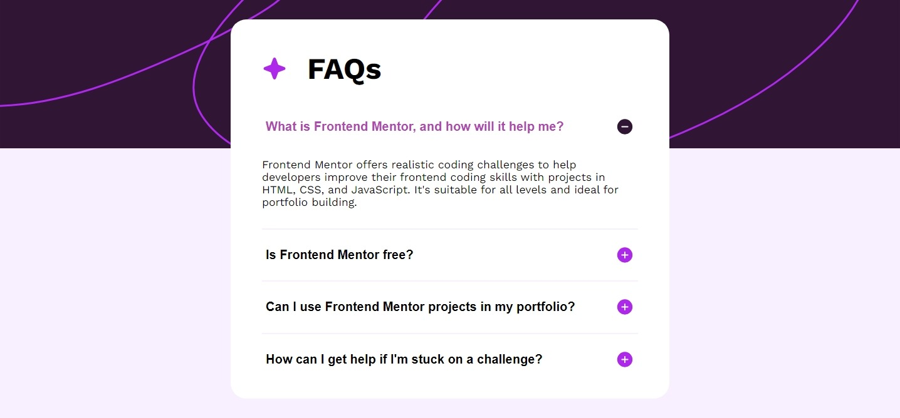

# Frontend Mentor - FAQ accordion solution

This is a solution to the [FAQ accordion challenge on Frontend Mentor](https://www.frontendmentor.io/challenges/faq-accordion-wyfFdeBwBz). Frontend Mentor challenges help you improve your coding skills by building realistic projects.

## Table of contents

- [Overview](#overview)
  - [The challenge](#the-challenge)
  - [Screenshot](#screenshot)
  - [Links](#links)
- [My process](#my-process)
  - [Built with](#built-with)
  - [What I learned](#what-i-learned)
  - [Continued development](#continued-development)
  - [Useful resources](#useful-resources)
- [Author](#author)
- [Acknowledgments](#acknowledgments)

## Overview

### The challenge

Users should be able to:

- Hide/Show the answer to a question when the question is clicked
- Navigate the questions and hide/show answers using keyboard navigation alone
- View the optimal layout for the interface depending on their device's screen size
- See hover and focus states for all interactive elements on the page

### Screenshot




### Links

- Solution URL: [GitHub Repository](https://github.com/horoserp/faq-accordion)
- Live Site URL: [Solution on My Site](https://horoserp.github.io/faq-accordion)

## My process

### Built with

- Semantic HTML5 markup
- CSS custom properties
- Flexbox

### What I learned

A friend on Frontend Mentor and LinkedIn encouraged me to return to the basics (HTML, CSS, JavaScript)...and so I did. What really stuck out to me was how much I forgot about basic JavaScript after having used React and JSX so regularly for the last 3 months. Also, due to regular use of React, I forgot how to write my relative paths so that GitHub Pages and VS Code could consume them with vanilla HTML/CSS.

Here is an example:

```html
<script src="./script.js"></script>
```

```css
.background {
  background-image: url("./images/background-pattern-desktop.svg");
}
```

### Continued development

I would like to continue doing projects using pure HTML, CSS and JavaScript to refresh my knowledge on the basics and hopefully find a few new things along the way.

### Useful resources

- [W3Schools](https://www.w3schools.com/) - This is a great reference site which helped me remember some of the required syntax and generalities surrounding JavaScript.
- [Stack Overflow](https://stackoverflow.com/) - This is an excellent resource for finding answers to precise questions. I used during this challenge to check how to fix my relative paths during deployment.

## Author

- Website - [Robert P. Horosewski](https://horoserp.github.io/React-Portfolio)
- Frontend Mentor - [@horoserp](https://www.frontendmentor.io/profile/horoserp)
- LinkedIn - [Robert P. Horosewski](https://www.linkedin.com/in/robert-horosewski-8a0608196/)

## Acknowledgments

Thanks to my wife for the encouragement to pursue my dream. Thank you Yacoub for taking the time to review my projects and provide feedback.
